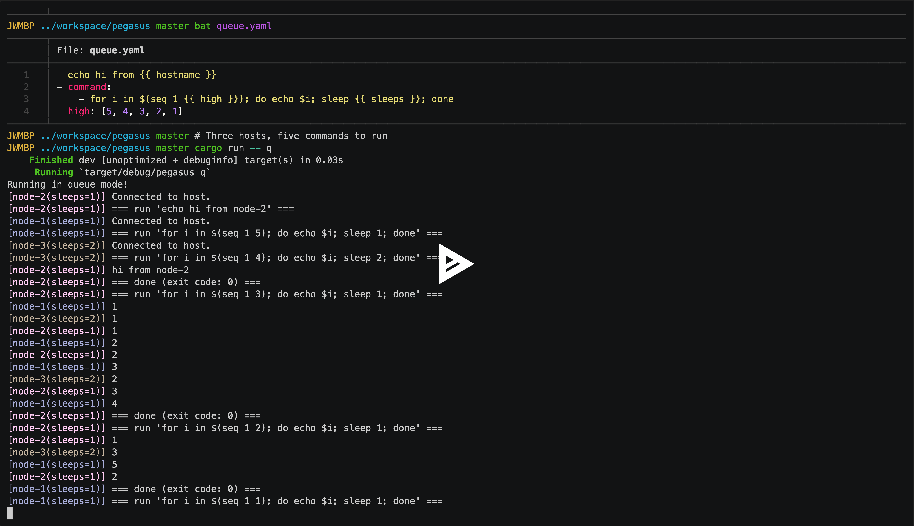

<div align="center">
<h1>Pegasus: A Multi-Node Command Runner</h1>
</div>

Run a list of commands on a set of SSH nodes. With a bit of optional parametrization.

## Demo

[](https://asciinema.org/a/T907oftlXQP0QWqLnF43IkCjo)

## Features

- Passwordless SSH is all you need.
- **Simple** config for simple use cases, **flexible** config for advanced ones.
- Two modes:
  - **Broadcast** mode runs each command on every node.
  - **Queue** mode runs each command on the next free node.
- Modify the queue **while** Pegasus is running.
- **Parametrize** hosts and commands.

## Getting Started with Examples

To use Pegasus,

1. Clone this repo (I'll soon release binaries, too).
2. Setup passwordless SSH for your nodes.
3. Populate `hosts.yaml` and `queue.yaml`, and run Pegasus.

Pegasus will remove one entry at a time from `queue.yaml` and move it to `consumed.yaml` as it executes it.

### Queue Mode: Getting a Bag of Jobs Done

Run four Python commands using two nodes.

```yaml
# hosts.yaml
- node-1
- node-2
```

```yaml
# queue.yaml
- . /opt/miniconda3/etc/profile.d/conda.sh; python train.py --bs 8
- . /opt/miniconda3/etc/profile.d/conda.sh; python train.py --bs 16
- . /opt/miniconda3/etc/profile.d/conda.sh; python train.py --bs 32
- . /opt/miniconda3/etc/profile.d/conda.sh; python train.py --bs 64
```

```console
$ cargo run -- q  # stands for Queue
```

### Broadcast Mode: Terraforming Nodes

Run identical setup commands for multiple nodes.

```yaml
# queue.yaml
- mkdir workspace
- cd workspace && git clone https://github.com/jaywonchung/dotfiles.git
- source workspace/dotfiles/install.sh
```

```console
$ cargo run -- b  # stands for Broadcast
```

### Splitting Nodes with Parameters

Split nodes into two sub-nodes. Below, *four* SSH connections are kept, and *four* commands run in parallel.

```yaml
# hosts.yaml
- hostname:
    - node-1
    - node-2
  container:
    - gpu0
    - gpu1
```

When parametrizing nodes, just make sure you specify the `hostname` key.

You can use these parameters in your commands. By the way, the templating engine is Handlebars.

```yaml
# queue.yaml
- docker exec {{ container }} python train.py --bs 8
- docker exec {{ container }} python train.py --bs 16
- docker exec {{ container }} python train.py --bs 32
- docker exec {{ container }} python train.py --bs 64
```

Four sub-nodes and four jobs. So all jobs will start executing at the same time.

### Parametrizing Commands

If you can parametrize nodes, why not commands?

```yaml
# queue.yaml
- command:
    - docker exec {{ container }} python train.py --bs {{ bs }}
  bs:
    - 8
    - 16
    - 32
    - 64
```

This results in the exact same jobs with the example above.
When parametrizing commands, just make sure you specify the `command` key.

### Quiz

How many commands will execute in Queue mode?

```yaml
# hosts.yaml
- hostname:
    - node-1
    - node-2
  laziness:
    - 1
- hostname:
    - node-3
  laziness:
    - 2
```

```yaml
# queue.yaml
- echo hi from {{ hostname }}
- command:
    - for i in $(seq 1 {{ high }}); do echo $i; sleep {{ laziness }}; done
    - echo bye from {{ hostname }}
  high:
    - 1
    - 2
    - 3
    - 4
```

Note that although `echo bye from {{ hostname }}` doesn't really use the `high` parameter, it will run four times.

### Modifying the Queue

`queue.yaml` is **actually** the queue.

Pegasus removes the first entry in `queue.yaml` whenver there's a free host available.
If you delete entries before Pegasus pulls it, they will not execute.
If you add entreis to `queue.yaml`, they will execute.

#### Q. Why do I need this?

Think about when the number of remaining commands is less than the number of free nodes. Without a way to submit more jobs to Pegasus, those free nodes will stay idle until all the commands finish and you start a fresh new instance of Pegasus.

By providing a way to add to the queue while commands are still running, users may achieve higher node utilization. Deleting from the queue is just a byproduct.

#### Q. But that's a race condition on `queue.yaml`.

Lock mode will lock `queue.yaml` and launch a command line editor for you.

```console
$ cargo run -- l --editor nvim  # l stands for Lock
```

When we save and exit, the lock is released and Pegasus is free again to read it.

#### Q. What if Pegasus terminates while I'm editing `queue.yaml`?

Enable daemon mode, and Pegasus will not terminate even if `queue.yaml` is empty. It will wait for you to populate `queue.yaml` again, and execute them.

```console
$ cargo run -- q --daemon
```
